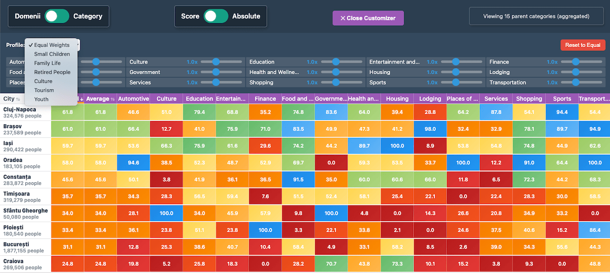

# City Atlas

City profile and comparisons based on number of attributes.

Answer questions like: I want to move to ? Prototype: [uat.gov2.ro/atlas](https://uat.gov2.ro/atlas/). Data fetched with [pax/gis-places-osint](https://github.com/pax/gis-places-osint)

Ranks cities based on venue / services counts and other attributs (ex: non stop shops, pharmacies, non stop, bars, cafes, cinema, theaters, cinemas, museums, public toilets etc). see [venue types](reference/places-api-queries.csv)

---

## Roadmap
- [x] MPV UI
    - [x] figure out stack
    - [x] read data from db/api [Goolge Maps Places Aggregate API](https://developers.google.com/maps/documentation/places-aggregate/overview)
    - [x] how to calculate scores?-
    - [x] norm to population
- [x] split categories by parent categories / grouping
- [x] weighted scores
- [ ] icons for categories

### Later

- [ ] add INS + OSM data
- [ ] multi lang
- [ ] text to sql - hugginface trained model
- [ ] Reddit threads - vreau să mă mut în <City>

see [brainstorming](reference/brainstorming/)

## Views

- [ ] landing
- [ ] city profile
- [x] overall multi-city table
- [ ] Side-by-side comparison
- [ ] Criteria builder
- [ ] rankings/reports
- [ ] static: about, contact, methodology

### Landing
- intro
- criteria switcher
- map
- compact list (cards) view

### City Profile

### Overall table

heatmap 
can select cities, variables
custom criteria widget / prefilled profiles

### City comparison side-by-side

somewhat similar with _Overall table_ more focused / dedicated UI, a bit towards _City Profile_

### Criteria builder

percentage slider for each criteria
pre-built sample criterias (kids friendly, nighltife, culture, retirement)

### Report analysis

Custom dashboards, lists - best city for ..

